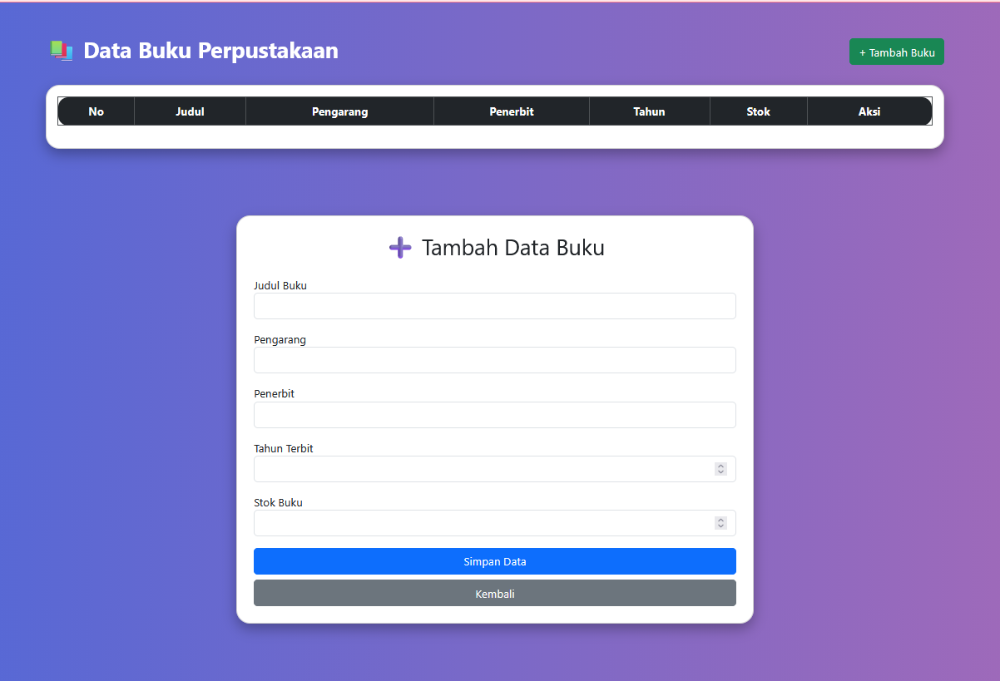
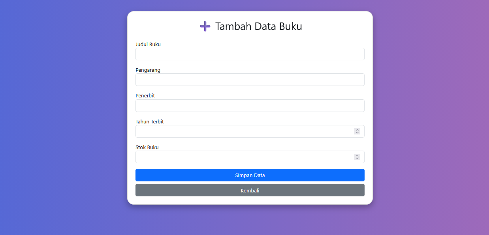
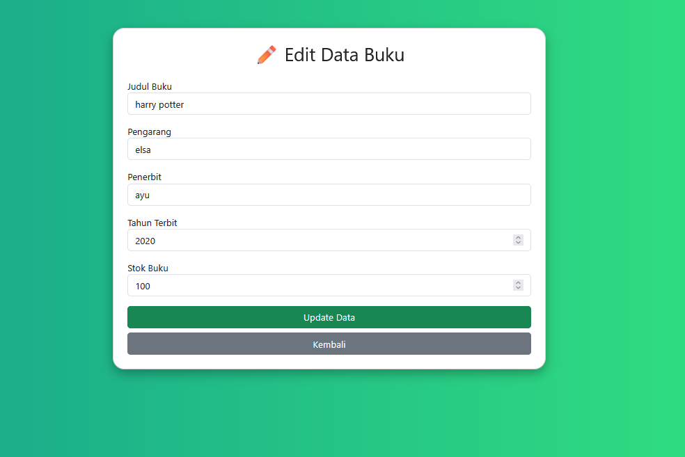
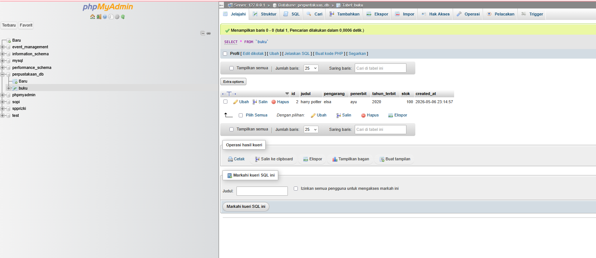

# T4-week10 - Aplikasi CRUD PHP MySQL

Nama  : Elsa Ayu Ramadani  
NIM   : F1D02410005  
Kelas : C

## Deskripsi
Aplikasi CRUD (Create, Read, Update, Delete) menggunakan PHP, MySQL, dan Bootstrap.

- Database : perpustakaan_db
- Tabel    : buku

## Cara Menjalankan
1. Import file `.sql` ke phpMyAdmin
2. Letakkan folder project di dalam `htdocs` (XAMPP)
3. Jalankan Apache dan MySQL pada XAMPP
4. Buka browser:
   http://localhost/T4-week10/

## Screenshot

### Daftar Data

### Tambah Data

### Edit Data

### Struktur Database (phpMyAdmin)
